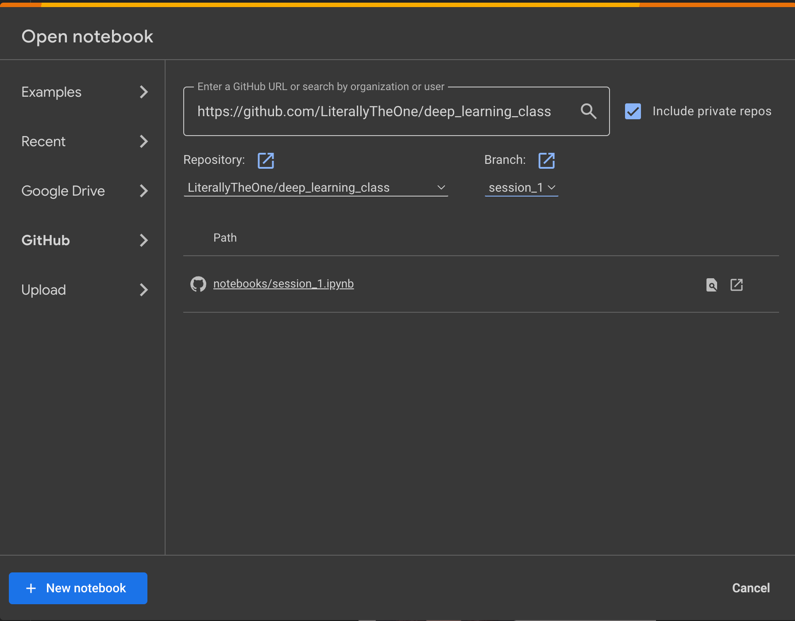
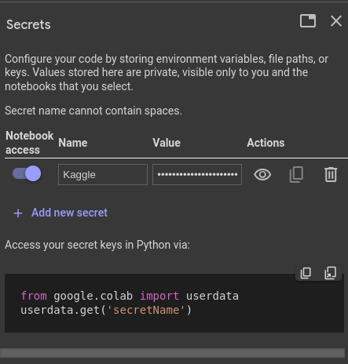

# Session 1: Introduction

## Tensorflow

`Tensorflow` is an open source library developed by `Google`.
The main purpose of `Tensorflow` is to give us the power of
manipulating mathematical expressions on numerical `tensors`.
Somehow like `NumPy` but with some extra features, like:

* Calculating gradient
* Can run on `GPU`, `TPU` and `CPU`
* Computation can be distributed on different machines pretty easily
* It has an API for other programming languages like `c++` and `Java-script`.

## Keras

`Keras` is a high level API for building and training **Deep learning** models.
It was designed to be a stand-alone project.
But with the help of `tensorflow`, `PyTorch` and `Jax` it can run on top of different hardware.

## Google Colab

[Google colab](https://colab.research.google.com/) is a free could-based platform that
is powered by `jupyter notebook`.
Every thing that we are going to use in this class is already installed on
[Google colab](https://colab.research.google.com/).
But if you like to run the codes in your local device,
you can install them manually.

## Load notebook from GitHub to Colab

To load a notebook from `GitHub` directly to `Google colab`, first we should press `Ctrl+O` (open notebook). Then in the
`GitHub` tab, we can copy the address of the repository that contains the notebooks that we want to load. After that, a
list of notebooks will show up then we can select the one that we wanted. One example is provided below:



In this session, I’m using the codes provided in https://github.com/LiterallyTheOne/deep_learning_4021 repository.

## Deep learning Hello World

```python
from tensorflow.keras.datasets import mnist
from tensorflow import keras
from tensorflow.keras import layers

# prepare data
(train_images, train_labels), (test_images, test_labels) = mnist.load_data()

train_images = train_images.reshape((60000, 28 * 28))
train_images = train_images.astype("float32") / 255
test_images = test_images.reshape((10000, 28 * 28))
test_images = test_images.astype("float32") / 255

# define our model
model = keras.Sequential([
    layers.Dense(512, activation="relu"),
    layers.Dense(10, activation="softmax")
])

model.compile(optimizer="rmsprop",
              loss="sparse_categorical_crossentropy",
              metrics=["accuracy"])

# train our model
model.fit(train_images, train_labels, epochs=5, batch_size=128)

# test our model
test_loss, test_acc = model.evaluate(test_images, test_labels)

```

## Prepare Data

```python
(train_images, train_labels), (test_images, test_labels) = mnist.load_data()

train_images = train_images.reshape((60000, 28 * 28))
train_images = train_images.astype("float32") / 255
test_images = test_images.reshape((10000, 28 * 28))
test_images = test_images.astype("float32") / 255
```

## Define Model

```python

model = keras.Sequential([
    layers.Dense(512, activation="relu"),
    layers.Dense(10, activation="softmax")
])

model.compile(optimizer="rmsprop",
              loss="sparse_categorical_crossentropy",
              metrics=["accuracy"])

```

## Train

```python
model.fit(train_images, train_labels, epochs=5, batch_size=128)
```

## Test

```python
test_loss, test_acc = model.evaluate(test_images, test_labels)
```

## Kaggle

Kaggle is one of the biggest platforms for data science and machine learning enthusiasts.
It contains a huge number of datasets and a variety of competitions.

If you don't have an account in Kaggle, you can simply make an account, by clicking on the register button on the top
right of the site.
If you already have an account you can log in to your account using Sign in at the top right of the site.

## Kaggle API token

After you sign in successfully, you can get your Kaggle API token by following these steps:

* Go to the settings of your account
* Go to the API section
* Press the Create New Token button

Doing the steps above will automatically start downloading a file called kaggle.json. We need this file in the next
steps. the content of this file looks like this:

```json
{
  "username": "your_user_name",
  "key": "your_key"
}
```

## Create a new secret in Google Colab

So, now we are going to create a secret in Google Colab. To do so, we should follow these steps:

* Open or create a new notebook
* Click on the key logo on the left sidebar
* Press Add new secret
* Name the secret whatever you want, I name it Kaggle
* Copy all the content of kaggle.json that you already got it from the previous step to the value column.
* Slide the Notebook access to give this notebook access to this secret

After doing all the above steps, you should have something like this:



## Prepare the required file for using Kaggle CLI

To be able to use **Kaggle CLI**,
we have to have a file in ``/root/.kaggle/kaggle.json``
with the content of our **secret** that we already made.

At first, we should get the **value** of our **secret**,
using the code below:

```python

from google.colab import userdata

kaggle_api = userdata.get('Kaggle')

```

The code above gets the **value** of the **secret**
and puts it in a variable called ``kaggle_api``.

Then we use the code below to make the file in the
path that is required and put the **value** in it.

```python

from pathlib import Path

target_path = Path('/root/.kaggle/kaggle.json')

target_path.parent.mkdir(parents=True, exist_ok=True)

with target_path.open('w') as target_file:
    target_file.write(kaggle_api)

```

After doing that, we can optionally change the
permission of that file to *600*.

```shell

! chmod 600 /root/.kaggle/kaggle.json
    
```

Now we are ready to use **Kaggle CLI**.

## Download a dataset

To download a dataset from
[Kaggle](https://www.kaggle.com/),
we can simply follow these steps:

* Go to the dataset that you want to download
* Press the three dots on the top right of the page
* Click on **Copy API command**
* Create a new cell in
  [Google Colab](https://colab.research.google.com>).
* Put an **!**, then paste the command after that
* Run the cell

After doing these steps, you can see the zip file of
the dataset, in the **files**.

## Assignment

* Change the dataset to a new dataset
  from available datasets in keras
    * [MNIST](https://keras.io/api/datasets/mnist/)
    * [CIFAR10](https://keras.io/api/datasets/cifar10/)
    * [CIFAR100](https://keras.io/api/datasets/cifar100/)
    * [Fashion MNIST](https://keras.io/api/datasets/fashion_mnist/)
* Find a dataset in [Kaggle](https://www.kaggle.com/)
    * Image
    * Classification